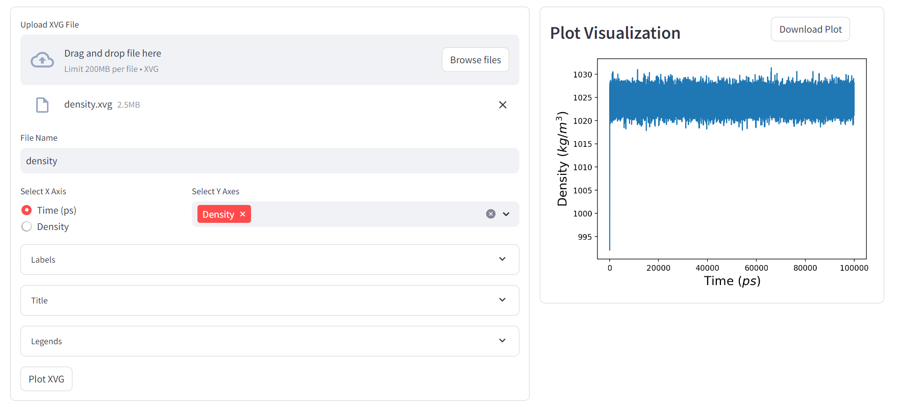
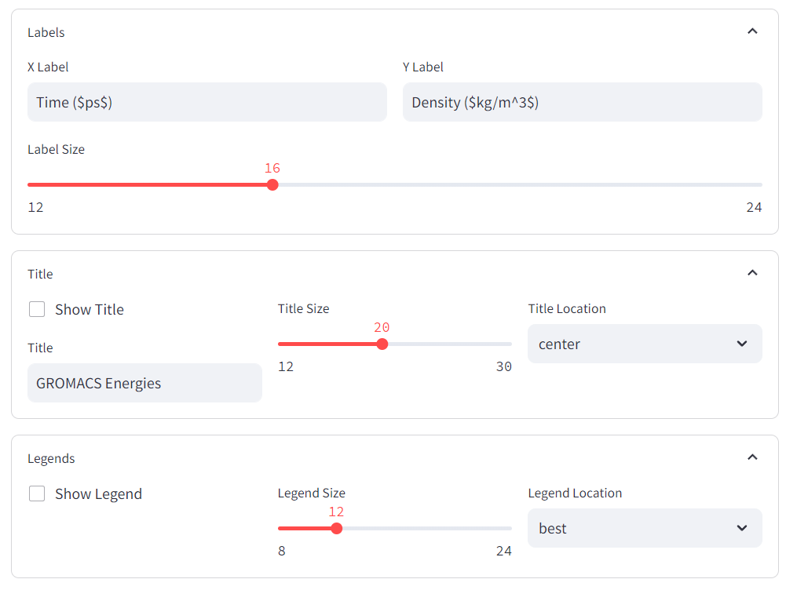
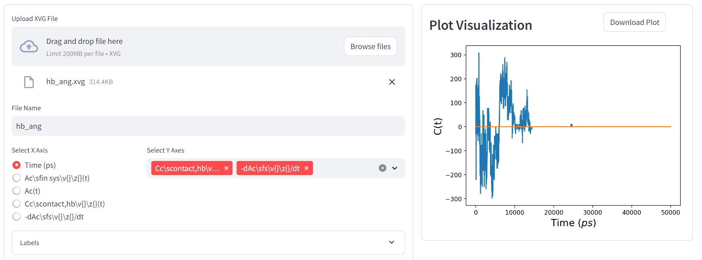
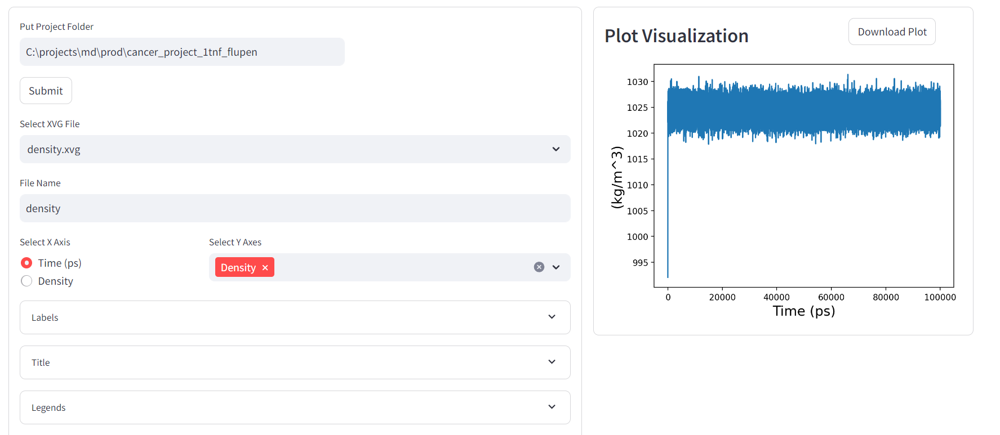
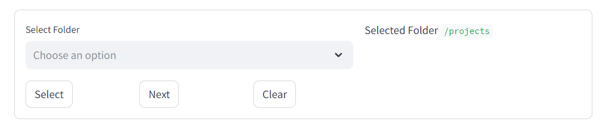
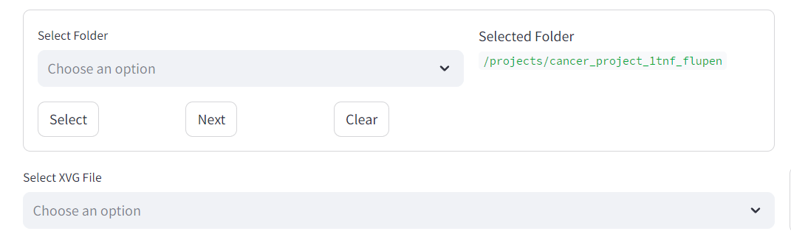

# XVG Plotter

## Introduction

XVG Plotter is a plotting tool for xvg files based on streamlit library.

## Installation

### Anaconda

1. Run create environment command.

```shell
conda env create -f environment.yml # for windows

conda env create -f environment-linux.yml # for linux

conda activate xvg-plotter
```

2. Start streamlit app

```shell
streamlit run main.py
```

The app will be start on port 8501 and you can access by http://localhost:8501.

If you want to run on another port run:

```shell
streamlit run main.py --server.port=7500
```

### Docker

1. Pull latest firesimulations/xvg-plotter image

```shell
docker pull firesimulations/xvg-plotter:latest
```

2. Run docker container

```shell
docker run -p 7500:7500 -d --name xvg-plotter firesimulations/xvg-plotter:latest
```

The app will be start on port 7500 and you can access by http://localhost:7500.

If you want to run on another port run:

```shell
docker run -p 8500:7500 -d --name xvg-plotter firesimulations/xvg-plotter:latest 
```

If you must provide docker volume for running Folder Analysis. For example, if your projects are in C:/projects/md/prod folder pass volume as `-v C:/projects/md/prod:/projects`.

`:/projects` should not be changed. Otherwise, it will show error.

```shell
docker run -p 7500:7500 -d -v C:/projects/md/prod:/projects --name xvg-plotter firesimulations/xvg-plotter:latest
```

## Usage

You can plot XVG file singly or select folder for ease selection.

### Single File Analysis







#### Options

1. File Name: File name for saving. File name will be auto generated up on selected file.
2. Select X Axis: Select X axis from radio button group.
3. Select Y Axis: Select Y axis from multi selection. You can plot multiple lines.
4. Labels:
    * X Label: X axis label. You can give equation by adding $. for example: `Density ($m^3$)`
    * Y Label: X axis label.
    * Label Size: Label font size of X and Y axes. You can select `12` to `24`.
5. Title
    * Show Title: Checkbox for showing title.
    * Title: Auto generated title from XVG file. Then you can update.
    * Title Size: Title font size. You can select `12` to `30`.
    * Title Location: Location of title.
6. Legends:
    * Show Legend: Checkbox for showing legend.
    * Legend Size: Legend font size. You can select `8` to `24`.
    * Legend Location: Location of legend.
7. Plot XVG: Button for plotting.
8. Download Plot: Button for downloading image.

### Folder Analysis

#### Options for Running Anaconda:



1. Put Project Folder: After copy and pasting project folder path, click Submit button. It will show success or error message after validating the path.
2. Select XVG File: All xvg file in the project folder will be populated here.
3. Other options are same as Single File Analysis.

#### Options for Running Docker:





1. Select Folder: Your passed volume in time of running container will be the root volume. Folders of the root folder will be populated automatically. Hidden folders will be excluded.
2. Action Buttons:
   * Select Button: After selecting a folder click Select Button if the XVG files are in the folder. 
   * Next Button: If XVG files are in child folder, then click Next Button to show children folders.
   * Clear Button: You can clear selection by clicking Clear Button.
3. Select XVG File: All xvg file in the project folder will be populated here.
4. Other options are same as Single File Analysis.
